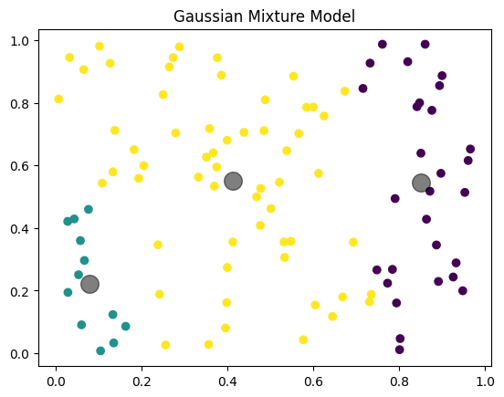

# GEOL0069-AI-Week-4
GEOL0069 Ai Week 4 GitHub submission

# Sea-Ice and Lead Unsupervised Classification
This projects utilises unsupervised machine learning technoques to discriminate sea ice and leads from satellite imagery. The satelite used to collect the data was the Sentinel-3 OLCI. This project will compare unsupervised classifications against ESA-provided ground truth products to evaluate model performance,

We will be using a two cluster approach implementing abd comparing:

- K-mean clusterin
- Gaussian Mixture Models (GMM)

The project is developed and run entirely in google colab

# Table of Contents
- Introduction
- Unsupervised Learning Methods
- - K-means Clustering
  - Gaussian Mixture Models
- Getting Started
- Installation
- Data Description
- Contact
- Acknowledgments

# Introduction

Sea ice plays a critical role in the Earth's climate system by regulating heat exchanges, ocean circulation, and albedo. Leads are fractures in the ice which are particularly important as they enhance heat and moisture fluxes between the ocean and atmopshere.

The accurate identification of sea ice and leads from satellite data is crucial for 

- Climate modelling
- Polar Navigation
- Environmental monitoring

  This project will explore whether unsupervised learning methods can successfully classify sea ice and leads without labelled training data.

  # Getting Started

This project is implemented using Google Colab, a cloud-based python environment that provides:

- Free access to GPU/TPU resources
- Seamless inegration with Google Drive
- Easy sharing and reproducibility

To run the notebook:
- Open the .ipynb file in this repository.
- Click "Open in Colab"
- Ensure required data are correctly linked

# Installation

The following python packages are required

```Python 
!pip install rasterio
!pip install netCDF4
!pip install basemap
!pip install cartopy
```
# Unsupervised Learning Methods

# K-means Clustering

k-means clustering is a form of unsupervised learning it is an algorithm that partitions a dataset into k predefined clusters by minimising within-cluster variance (MacQueen, 1967).

# Why K-means?

K-means is advantagous as:

- It does not require prior knowledge of data labels
- It is computationally efficient and scalable
- It is easy to implement and interpret

# Key Components

- Number of clusters (k): defined by the user
- Centroid initialisation: affects convergence and final cluster placement
- Assignment step: data points are assigned to the nearest centroid using Euclidean distance.
- Update step: Centroids are recalculated as the mean of assigned points.

The assignmetn are update requirements are repeated iteratively until convergence is achieved, typically reaching a local minimum in variance

Advantages
- Fast and computationally efficient
- Simple to interpret
- Suitable for large satellite datasets

# Python code for K-means clustering
```from sklearn.cluster import KMeans
import matplotlib.pyplot as plt
import numpy as np

# Sample data
X = np.random.rand(100, 2)

# K-means model
kmeans = KMeans(n_clusters=4)
kmeans.fit(X)
y_kmeans = kmeans.predict(X)

# Plotting
plt.scatter(X[:, 0], X[:, 1], c=y_kmeans, cmap='viridis')
centers = kmeans.cluster_centers_
plt.scatter(centers[:, 0], centers[:, 1], c='black', s=200, alpha=0.5)
plt.show()
```
# Example K-means Clustering Output


# Gaussian Mixture Models

Gausian Mixture Models (GMMs) are probabilistic clustering models that represent data as a mixture of multiple Gaussian distribution (Reynolds 2009 and McLachian and Peel 2004).

# Why GMM?

GMM offer several advantages over K-means:

- Soft clustering: each pixel is assigned a probability of belonging to each class.
- Flexible cluster geometry: clusters can vary in size, orientation and shape

# Key Components

- Number of Gaussian components
- Expectation-Maximisation (EM) algorithm
- Covariance structure: spherical, diagonal, tied or full

# EM Algorithm
- Expectation (E-step): compute membership probabilites for each data point.
- Maximisation (M-step): update Gaussian parameters to maximise likelihood.

This process is repeated until model convergence.

# Advantages

- Probabilistic classification
- Handles overlapping classes
- More realistic representation of geophysical data distributions.

# Python code for Gaussian Mixture Models

```
from sklearn.mixture import GaussianMixture
import matplotlib.pyplot as plt
import numpy as np

# Sample data
X = np.random.rand(100, 2)

# GMM model
gmm = GaussianMixture(n_components=3)
gmm.fit(X)
y_gmm = gmm.predict(X)

# Plotting
plt.scatter(X[:, 0], X[:, 1], c=y_gmm, cmap='viridis')
centers = gmm.means_
plt.scatter(centers[:, 0], centers[:, 1], c='black', s=200, alpha=0.5)
plt.title('Gaussian Mixture Model')
plt.show()
```
# Example of a Gaussian Mixture Model




